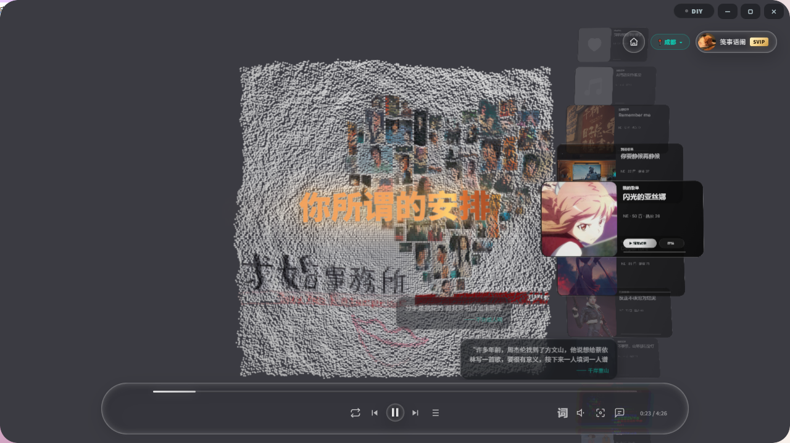
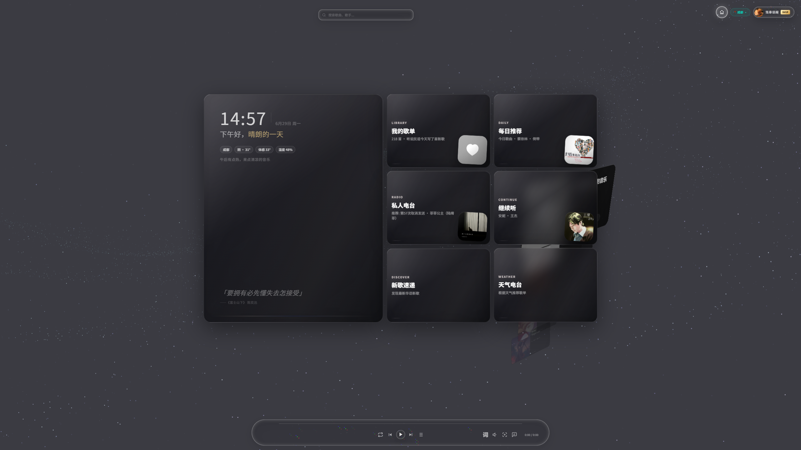

# Mineradio

Mineradio 是一款 Windows 桌面沉浸式音乐播放器，由 [XxHuberrr](https://github.com/XxHuberrr) 设计与开发，将天气电台、搜索播放、歌词舞台、粒子视觉和 3D 歌单架融合为一个接近现场感的私人音乐空间。

## 功能概览

**音乐播放**
- 网易云音乐账号登录，支持搜索、歌单、播客、每日推荐、私人电台
- QQ 音乐搜索与登录态音源补充
- 本地音乐文件导入播放
- 音质选择：超清母带 / 高清臻音 / 无损 SQ / 极高 HQ / 标准
- 播放模式：顺序循环、随机、单曲循环
- 自定义专辑封面上传与裁剪

**视觉体验**
- 7 种视觉预设：emily 封面粒子、滚筒隧道、星球雕塑、虚空、唱片、星河壁纸、安魂骷髅点云
- 电影镜头系统：基于 BPM 节奏自动运镜
- 歌词舞台：3D 歌词支持 12 种字体、自由调节大小/位置/角度/景深
- 粒子溢光、歌词发光、鼓点溢光、轮廓高亮等叠加效果
- 桌面歌词独立窗口，支持锁定穿透和电影震动
- 银河壁纸首页背景

**3D 歌单架**
- 右键唤起 3D 歌单架，以卡片形式浏览歌单和队列
- 支持动态/静态镜头、自动隐藏/常驻模式
- 播客歌单独立开关、收藏歌单合并开关
- PSP 风格机械齿轮选择音效

**天气电台**
- 基于 Open-Meteo 实时天气数据
- 根据城市、天气 mood 自动生成播放队列

**视觉控制台（DIY 模式）**
- 4 个用户存档槽位，可保存和导出完整视觉参数
- 7 个取色器：界面高亮、视觉主色、Home 填充、图标色、歌词色、发光色、歌单架色
- 歌词布局完整控制 + 高级性能设置（后台策略 / 画质档位）

## 界面预览

## 本仓库改动

在原版 Mineradio 基础上做了以下调整：

**界面**
- 窗口缩放 50%（原版 75%），最小 820×520
- Hero 区域全新排版：实时时钟 + 天气问候语 + 俏皮话 + 歌词轮播（104首）
- 首页卡片区与 Hero 底部对齐，无留白
- 全屏模式增加宽高阈值，文字和弹幕等比缩放
- 搜索栏更紧凑（380px / 44px）

**首页**
- 移除原版"施工中"占位页，恢复天气和推荐展示
- 听歌画像、常听歌手替换为新歌速递和天气电台入口

**Bug 修复**
- 修复切歌时弹幕残留（定时器未清理导致多首叠加）
- 修复 QQ 音乐歌曲弹幕不显示（ID 解析 + 服务端查正）
- 修复城市胶囊重启后始终显示"上海"
- 修复 IP 定位覆盖用户手动设置的城市
- 修复 Hero 问候语不显示
- 修复使用指引偶尔自动弹出
- 天气 API 增加 3 次重试

**其他**
- 控制栏新增弹幕开关按钮
- 天气城市切换改为弹窗式
- 启动画面中文化
- 合并原作者 v1.1.1 安装路径安全修复

程序本体保留 Mineradio 命名与品牌，版权归原作者所有。

## 下载安装

- **GitHub**：[Releases](https://github.com/JS1Lan/Lanote/releases) 下载 `Mineradio-1.1.1-Setup.exe`
- **夸克网盘**：[https://pan.quark.cn/s/27509f85c03d](https://pan.quark.cn/s/27509f85c03d)（含修改版 + 原版 + 更新包）

已安装 v1.1.0 的用户直接下载覆盖安装即可。

## 版权

Copyright (C) 2026 XxHuberrr. GPL-3.0 授权。原始项目：[XxHuberrr/Mineradio](https://github.com/XxHuberrr/Mineradio)
